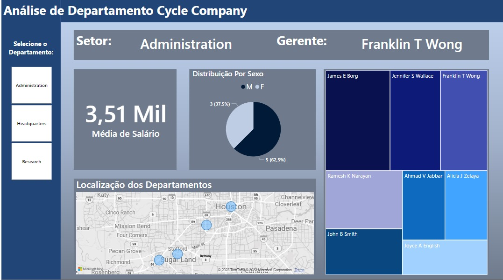
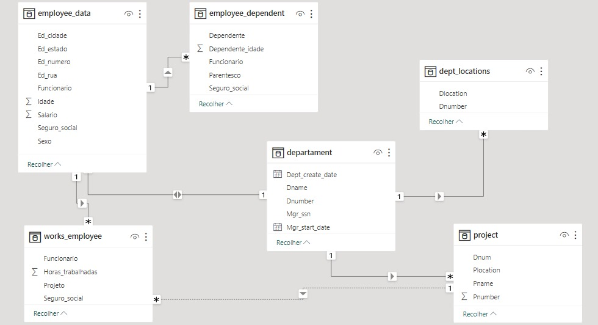

# Análise de Departamentos - Cycle Company

### Esse projeto explora conceitos de análise de dados, utilizando extração de dados do Mysql e realizando a transformação dos dados usando o Power BI, e por fim, criando um dashboard que possibilita a análise dos setores da empresa do case. 

Esse projeto é minha proposta de resolução para o desafio *Processando e Transformando Dados com Power BI* do programa **<span style="color:orange">Santander Bootcamp 2023 - Ciência de dados com Python</span>** oferecido pela [DIO.me](https://web.dio.me/).

**Dados base para o projeto**:

- [Dados Base](https://github.com/julianazanelatto/power_bi_analyst/tree/main/Módulo%203/Desafio%20de%20Projeto)


**Arquivos do Projeto**:
 - [Arquivo PBIX](./relatorio_powerbi/)
 - [Arquivos SQL](./scripts_sql/)
 - [Estrutura dos Dados](./scripts_sql/esquema_relacional_bd.jpg)
 - [Template do Dashboard](./template/layout.png)

 ## Dashboard Desenvolvido
**<span style="color:turquoise">Clique na imagem para abrir o relatório</span>**

 [](https://app.powerbi.com/view?r=eyJrIjoiZGVmMDhlYjgtYzQ4YS00NTE1LWE1YWYtMzhkOTg4OWM3MGNkIiwidCI6ImMxNDA5NGQwLTA0ZTMtNGM2YS1iMTM0LTg4ZTUxZDMwOWZmYyJ9)

O dashboard desenvolvido, trás uma visão geral da organização dos departamentos da Cycle Company, os dados análisados são:

- Setores e seus gerentes.
- Distribuição dos funcionários por sexo.
- Media salarial.
- Localização dos departamentos.
- Salário, setor, idade e quantidade de dependentes dos funcionários.

### Estrutura dos Dados



Podemos observar que se trata de uma estrutura de dados relacional.


## Criação do Banco de Dados e suas Tabelas


<details>
<summary>1. Criando o banco de dados:</summary>

```
create schema if not exists company_cycle_employee;

use company_cycle_employee;
```
</details>

<details>
<summary>2. Criando tabela 'employee':</summary>

```
CREATE TABLE employee(
Fname varchar(15) not null,
Minit char,
Lname varchar(15) not null,
Ssn char(9) not null, 
Bdate date,
Address varchar(30),
Sex char,
Salary decimal(10,2),
Super_ssn char(9),
Dno int not null default 1,
constraint chk_salary_employee check (Salary> 2000.0),
constraint pk_employee primary key(Ssn)
);
```
</details>

<details>
<summary>3. Criando tabela 'departament':</summary>

```
create table departament(
Dname varchar(15) not null,
Dnumber int not null,
Mgr_ssn char(9) not null,
Mgr_start_date date, 
Dept_create_date date,
constraint chk_date_dept check (Dept_create_date < Mgr_start_date),
constraint pk_dept primary key (Dnumber),
constraint unique_name_dept unique(Dname),
foreign key (Mgr_ssn) references employee(Ssn),
constraint fk_dept foreign key(Mgr_ssn) references employee(Ssn)
on update cascade
);
```
</details>

<details>
<summary>4. Criando tabela 'dept_locations':</summary>

```
create table dept_locations(
Dnumber int not null,
Dlocation varchar(15) not null,
constraint pk_dept_locations primary key (Dnumber, Dlocation),
constraint fk_dept_locations foreign key (Dnumber) references departament(Dnumber)
on delete cascade
on update cascade
);
```
</details>

<details>
<summary>5. Criando tabela 'project':</summary>

```
create table project(
Pname varchar(15) not null,
Pnumber int not null,
Plocation varchar(15),
Dnum int not null,
primary key (Pnumber),
constraint unique_project unique (Pname),
constraint fk_project foreign key (Dnum) references departament(Dnumber)
);
```
</details>

<details>
<summary>6. Criando tabela 'works_on':</summary>

```
create table works_on(
Essn char(9) not null,
Pno int not null,
Hours decimal(3,1) not null,
primary key (Essn, Pno),
constraint fk_employee_works_on foreign key (Essn) references employee(Ssn),
constraint fk_project_works_on foreign key (Pno) references project(Pnumber)
);
```
</details>

<details>
<summary>7. Criando tabela 'dependent':</summary>

```
create table dependent(
Essn char(9) not null,
Dependent_name varchar(15) not null,
Sex char,
Bdate date,
Relationship varchar(8),
primary key (Essn, Dependent_name),
constraint fk_dependent foreign key (Essn) references employee(Ssn)
);
```
</details>

<details>
<summary>8. Visualizando todas as tabelas criadas:</summary>

```
show tables;
```
</details>

## Realizando Consultas SQL no Banco de Dados


<details>
<summary>Consulta tabela employee:</summary>

``` 
select * from employee;
```
</details>

<details>
<summary>Consulta tabela departament:</summary>

``` 
select * from departament;
```
</details>

<details>
<summary>Consulta tabela dept_locations:</summary>

``` 
select * from dept_locations;
```
</details>

<details>
<summary>Consulta tabela project:</summary>

``` 
select * from project;
```
</details>

<details>
<summary>Consulta tabela works_on:</summary>

``` 
select * from works_on;
```
</details>

<details>
<summary>Consulta tabela dependent:</summary>

``` 
select * from dependent;
```
</details>


<details>
<summary>Consulta dados dos funcionarios e seus gerentes:</summary>

``` 
select
    concat(e.Fname, ' ', e.Minit, ' ', e.Lname) as Funcionarios,
	e.Ssn as Funcionarios_Ssn,
    (timestampdiff(year, e.Bdate, current_date())) as Gerentes,
    e.Address as Funcionarios_endereco,
    e.Sex as Funcionarios_Sexo,
    e.Salary as Funcionarios_Salario,
    concat(m.Fname, ' ', m.Minit, ' ', m.Lname) as Gerentes,
    d.Dname as Departamentos
from employee e
inner join departament d on e.Dno = d.Dnumber
left join employee m on e.Super_ssn = m.Ssn; 
```
</details>


<details>
<summary>Consulta projtos e localização:</summary>

``` 
select 
	Essn, Pno, Hours, Pname, Plocation 
from works_on, project 
where Pnumber = Pno;
```
</details>

<details>
<summary>Consulta projetos, funcionarios, departamento e projetos:</summary>

``` 
select 
    concat(f.Fname, ' ', f.Minit, '. ', f.Lname) AS Gerentes,
    concat(g.Fname, ' ', g.Minit, '. ', g.Lname) AS Funcionarios,
    d.Dname AS Departamento,
    p.Pname as Projeto
from employee f
inner join employee g ON f.Ssn = g.Super_ssn
inner join departament d ON d.Mgr_ssn = f.Ssn
inner join project p on p.Dnum = f.Dno;
```
</details>


<details>
<summary>Consulta gerentes:</summary>

``` 
select 
	concat(e.Fname,' ',e.Minit,'. ',e.Lname) as Gerentes
from employee e
inner join departament d on e.Ssn = d.Mgr_ssn;
```
</details>


<details>
<summary>Consulta funcionarios por projeto e horas trabalhadas:</summary>

``` 
select
	Ssn as Seguro_social,
    concat(Fname,' ', Minit, '. ', Lname) as Funcionario,
    Pname as Projeto,
	Hours as Horas_trabalhadas
from works_on, employee, project
where Essn = Ssn and Pnumber = Pno;
```
</details>


<details>
<summary>Consulta dados dos funcionários:</summary>

``` 
select 
	Ssn as Seguro_social,
    concat(Fname,' ',Minit, '. ', Lname) as Funcionario,
	Sex as Sexo,
    (timestampdiff(year, Bdate, current_date())) as Idade, 
    Salary as Salario,
	substring_index(substring_index(Address, '-', 1), '-', -1) as Ed_numero,
	If(  length(Address) - length(replace(Address, '-', ''))>1,  
	substring_index(substring_index(Address, '-', 2), '-', -1) ,NULL) as Ed_rua,
	substring_index(substring_index(Address, '-', 3), '-', -1) as Ed_cidade,
	substring_index(substring_index(Address, '-', 4), '-', -1) as Ed_estado
from employee;
```
</details>


<details>
<summary>Consulta funcionarios com dependentes:</summary>

``` 
 select
	Essn as Seguro_social,
	concat(Fname, ' ', Minit,' ', Lname) as Funcionario,
	Dependent_name as Dependente,
	Relationship as Parentesco,
	(timestampdiff(year, d.Bdate, current_date())) as Dependente_idade 
 from employee, dependent d
 where Essn = Ssn;
```
</details>
